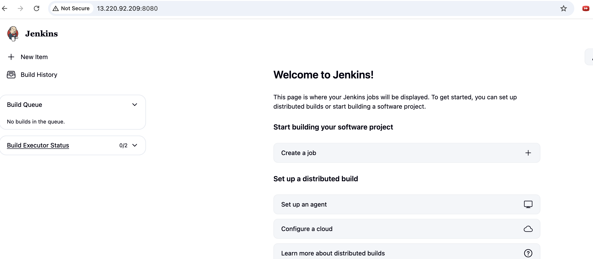
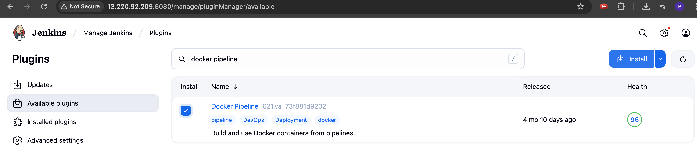
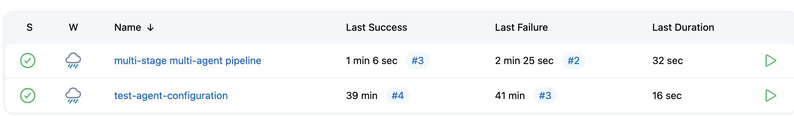

# jenkins

#### steps to setup jenkins on ec2 server

1. launch ec2 instance on AWS and ssh into it
2. install java JDK -  
   $ sudo apt update  
   $ sudo apt install fontconfig openjdk-21-jre  
   $ java -version  
3. install jenkins  
   $ sudo wget -O /etc/apt/keyrings/jenkins-keyring.asc https://pkg.jenkins.io/debian-stable/jenkins.io-2023.key  
   $ echo "deb [signed-by=/etc/apt/keyrings/jenkins-keyring.asc]" https://pkg.jenkins.io/debian-stable binary/ | sudo tee /etc/apt/sources.list.d/jenkins.list > /dev/null  
4. edit inbound rules on the security group attached to ec2 instance to allow traffic on port 8080 which is where jenkins runs 
5. take the public ip of ec2 instance and access through any browser using port 8080

jenkins master can be installed on a node, but with agents, it is always recommended to go with containers rather than nodes for better use of resources. It saves cost and improves efficiency.

Ideally we would need use different instances to spin up containers, but for sake of simplicity, I will set up docker on the same instance. We can also install docker on a different machine, but we need to configure that as a slave.

##### Docker setup
$ sudo apt update
$ sudo apt install docker.io

The docker daemon should be accessible for the jenkins and ubuntu user.

$ sudo su -  
$ usermod -aG docker jenkins
$ usermod -aG docker ubuntu 
$ systemctl restart docker

Restart jenkins: http://<ec2-instance-public-ip>:8080/restart

##### Install docker pipeline plugin in jenkins

1. log into jenkins 
2. manage jenkins > manage plugins
3. install docker pipeline plugin

### Create pipeline to test if docker slave configuration is working as expected, and then with multi-agent multi-stage pipelines

